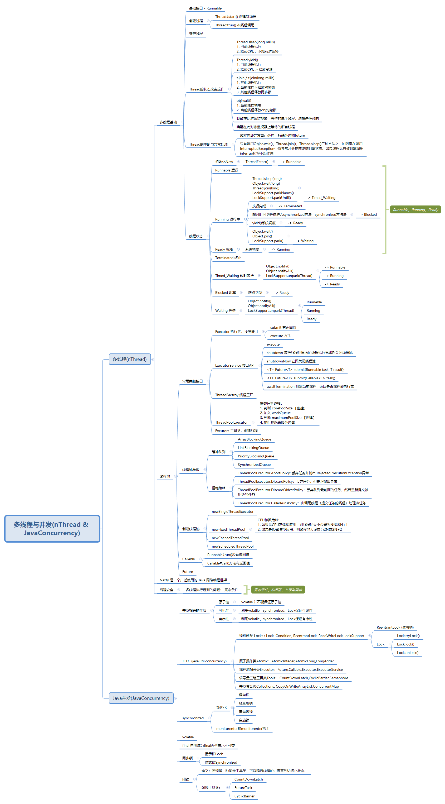

# 第四周作业

#### 作业2：

1.方法1：

```java
public class Method01 {
    public static void main(String[] args) {
        CountDownLatch countDownLatch = new CountDownLatch(1);
        Thread t = new Thread(new MyThread(countDownLatch));
        t.start();
        try {
            countDownLatch.await();
        }catch (InterruptedException e){
            e.printStackTrace();
        }
    }
    static class MyThread implements Runnable{
        private CountDownLatch countDownLatch;
        public MyThread(CountDownLatch countDownLatch){
            this.countDownLatch = countDownLatch;
        }
        @Override
        public void run() {
            System.out.println("hello.......");
            countDownLatch.countDown();
        }
    }
}
```

2.方法2：

```java

```

3.方法3：

```java

```


#### 作业6:



