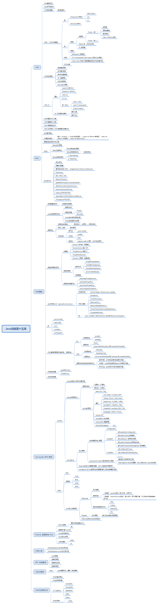

# Java进阶训练营实战 作业

# 第15周作业

## 作业题目
分别用 100 个字以上的一段话，加上一幅图 (架构图或脑图)，总结自己对下列技术的关键点思考和经验认识:
- JVM
- NIO
- 并发编程
- Spring 和 ORM 等框架
- MySQL 数据库和 SQL
- 分库分表
- RPC 和微服务
- 分布式缓存
- 分布式消息队列

## 上面的知识点的脑图

## 对各个技术的关键点思考和经验认识

- JVM

- NIO

- 并发编程

- Spring 和 ORM 等框架

- MySQL 数据库和 SQL

- 分库分表

- RPC 和微服务

- 分布式缓存

- 分布式消息队列
